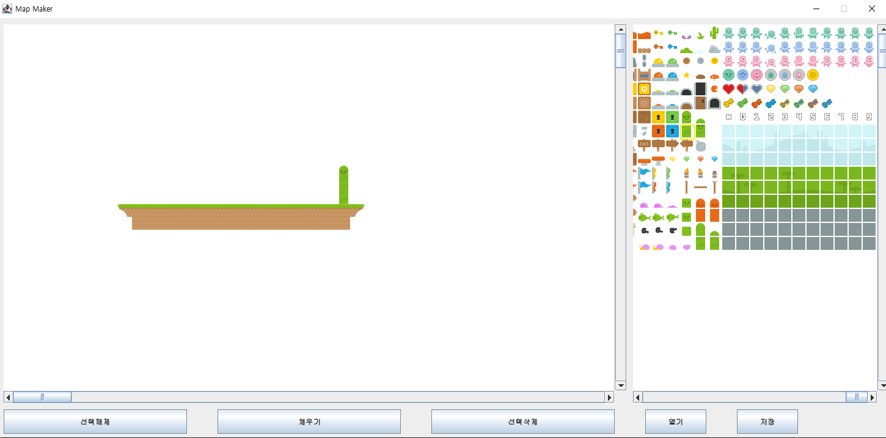

# 2DMapMaker

JSON format 2D game map maker

## Features

- **좌측** : 맵 디자이너, **우측** : SpriteSheet
- SpriteSheet에서 선택한 Tile로 Map을 만드는 기능
  - SpriteSheet에서 Tile 선택 후 맵 디자이너에서 클릭시 Tile 생성
- Map 데이터는 JSON 포맷으로 저장
- 맵 생성 창에서 드래그를 통해 여러 Tile 동시에 채우기, 삭제 가능
- 내보내기, 불러오기

## Screenshot

